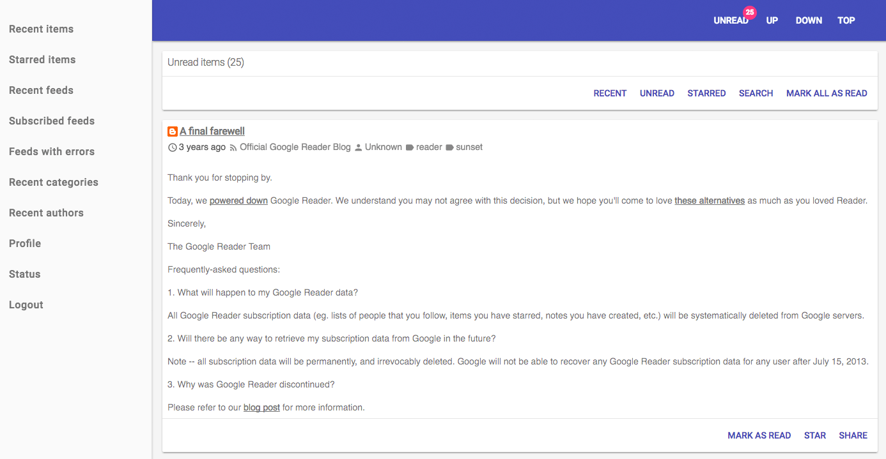

####Requirements

#####Language
* PHP 5.5 or greater
* php-curl
* php-iconv
* php-mbstring
* php-gmp
* php-tidy (recommended, to cleanup and repair html from feeds)

#####Database
* MySQL 5.5.3 or greater (utf8mb4 character set)

To fix ```#1709 - Index column size too large. The maximum column size is 767 bytes.```, add in MySQL configuration:

```
innodb_large_prefix = ON
innodb_file_format = BARRACUDA
```

#####Web server
* Apache 2.2 or greater with mod_rewrite module enabled (and "Allowoverride All" in VirtualHost / Directory configuration to allow .htaccess file)
* Nginx (see [/docker/nginx/nginx.conf](/docker/nginx/nginx.conf))

####Installation

```text
cd /path-to-installation
chmod +x install.sh && chmod +x update.sh
./install.sh
```

Set commands
```text
crontab -e
# m h dom mon dow command
0 * * * * cd /path-to-installation && bin/console readerself:collection
#10 * * * * cd /path-to-installation && bin/console readerself:notification
#20 * * * * cd /path-to-installation && bin/console readerself:elasticsearch
```

####Update

```text
cd /path-to-installation
./update.sh
```

####Client
http://example.com/client
- Email: example@example.com
- Password: example

####Api documentation
http://example.com/api/documentation

####Docker
```
cd /path-to-installation
docker-compose up --build
```

####Screenshots




